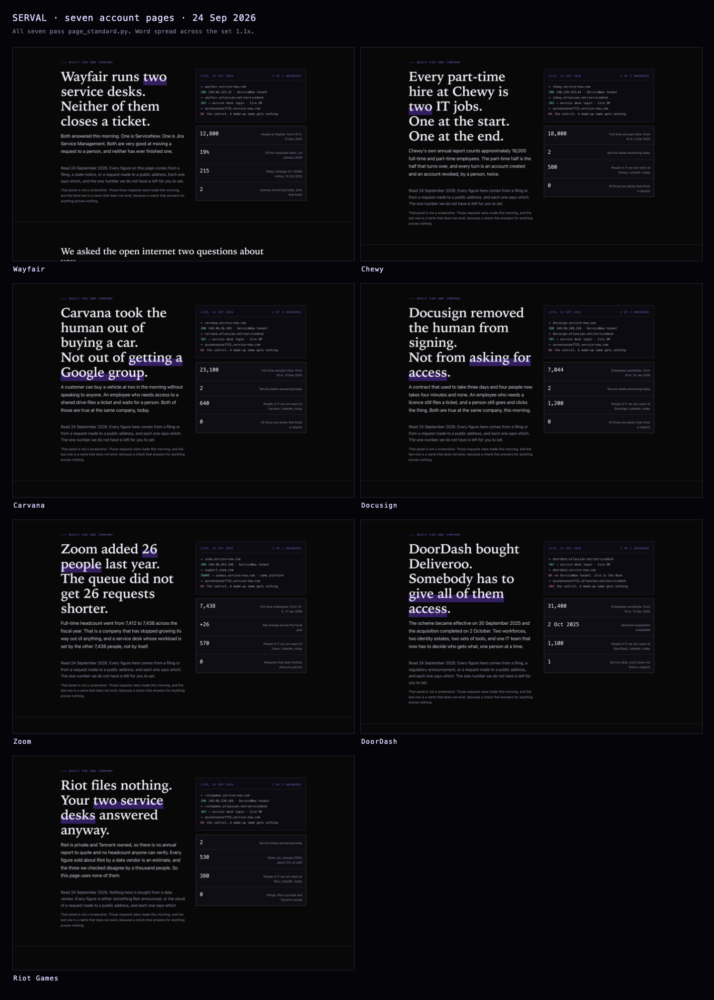
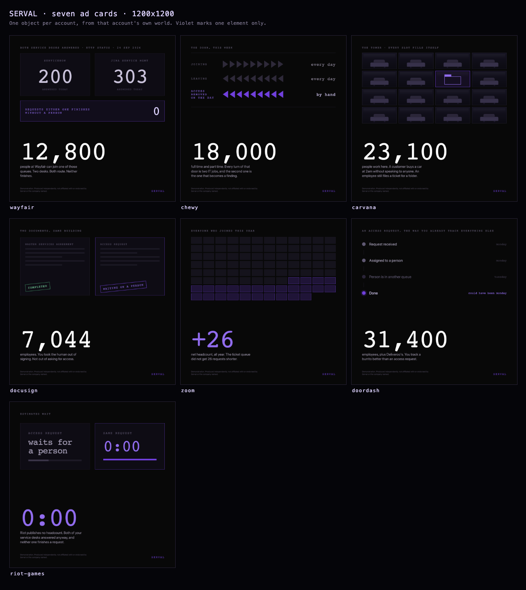
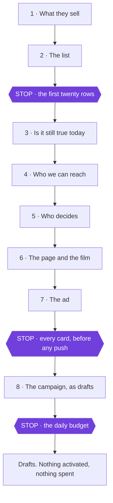

# One-to-One ABM on LinkedIn

A [Claude Code](https://claude.com/claude-code) skill that runs a true 1:1 ABM campaign end to
end: one ad set per named company, each audience narrowed to the people who decide, each ad
pointing at a page built for that one company and nothing else.

**The account list is derived, not handed over.** You give it a client URL. It works out who has
the problem today, finds the public file that proves it, reads that file, and builds the list
from what it found.



## What it does

1. **Reads what the client sells** from their own site, and derives the four tests a company has
   to pass to be worth a page
2. **Builds the list** from a public signal that is true today, with a control that proves the
   signal is about that company and not an artefact of how it was checked
3. **Re-reads every figure on the day**, and puts aside anything mid-acquisition, because a
   company being bought does not choose a supplier
4. **Sizes each audience live** against LinkedIn's own endpoint, and narrows to the 300 to 1,000
   band, one lever at a time, per company
5. **Names the buying committee** from public sources first, and asks before spending a credit
6. **Builds a page and a film per account**, written from the buyer's seat, not the vendor's
7. **Writes the ad**, one idea and one format each, from an object in the target's own world
8. **Builds the campaign as drafts** at zero spend, then hands over a document that argues the
   work rather than describing it

## What comes out

- **A landing page per account** · around 3,000 words each, written from the seat of the person
  who owns the problem, with peers as proof and the client as the thing those peers used
- **An ad card per account** · the target's own filed number as the biggest thing on it, and the
  client's colour marking the one element that carries the meaning
- **A draft campaign** · one ad set per company, correctly named so cold and warm can never
  collide in a report
- **A handover** · how the list was built, every decision and why it went that way, and a
  column headed "not done" that is as long as the one headed "done"



## The eight parts, and where a human is needed



Three stops always happen: **the list, the ad, and the money.** Those are the three where being
wrong is expensive and hard to undo. Two more stop only under a condition: part 4 if a company
comes out too small to reach, part 5 if a name has to be bought.

`python3 scripts/status.py --run <run>` tells you which part you are on and what it is waiting
for. It compares the config templates byte for byte, so an untouched file never counts as progress.

## What you need before you start

| | Needed for | Note |
|---|---|---|
| Claude Code | all of it | the skill is instructions plus scripts |
| Python 3 | all of it | the research, the narrowing and the campaign build use only the standard library |
| A LinkedIn ad account | parts 4 and 8 | |
| **LinkedIn Marketing API access** | parts 4 and 8 | **Apply on day one.** Four weeks at best, about four months typically. Everything up to part 7 runs without it |
| A GitHub token and a Pages repo | publishing the account pages | |
| `pip install -r requirements.txt` | the screenshots | pillow and playwright, nothing else |
| Node and Chrome | the hero film only | `npm install` in `scripts/`. Optional |
| A people-search provider | part 5, the champion seat | Optional and paid. The other three committee seats come from public sources |

## The rules that make it trustworthy

- **Everything is built DRAFT.** Activation is a separate, deliberate, human action this skill
  never takes.
- **A zero is never an answer.** LinkedIn returns 0 for "below the reporting floor", "no such
  company", "a copycat page" and "nobody there in that country", and the four are identical.
  Finding out which is part of the work.
- **A check that cannot fail proves nothing.** Every signal is run against a name that does not
  exist. Two of the four checks originally used for the Serval run were thrown away because they
  answered for `qzxnonsense7731`.
- **No number is invented.** Every figure traces to a filing, a regulatory notice, or a request
  made to a public address, and arithmetic on those is labelled as arithmetic.
- **The page is written from the buyer's seat.** Nobody buys a product from the vendor's own
  wall. A quality gate refuses a page that lets the vendor narrate itself.
- **The guard fails closed.** A write to any ad account not on your own allowlist is refused
  before anything is created, and a missing allowlist is a refusal rather than a default.

## See four finished runs

**[20 target companies across 4 advertisers](examples/)**, every artefact each run produced.

| Run | Target companies | |
|---|---|---|
| [serval](examples/serval/) | 7 | Wayfair, Chewy, Carvana, Docusign, Zoom, DoorDash, Riot Games |
| [elevenlabs](examples/elevenlabs/) | 6 | BT, Monzo, British Gas, Admiral, easyJet, HMRC |
| [wyn](examples/wyn/) | 4 | HMRC, Home Office, MHCLG, UKHSA |
| [revolut](examples/revolut/) | 3 | Hays, Currys, Renishaw |

Every page is live and clickable, not a screenshot. None of the four advertisers commissioned
this and none of the twenty target companies was contacted.

The run log is the part worth reading. It records a date taken from a layoff tracker and
rejected in favour of the primary source, four ad cards rebuilt for failing the standalone test,
and every card rebuilt a second time to strip figures that had been invented.

## Install

This is a Claude Code skill. Drop the folder into your skills directory:

```bash
git clone https://github.com/jeanmundabi-max/abm-1to1.git
cp -r abm-1to1/abm-1to1 ~/.claude/skills/
```

Then in Claude Code, say what you want in plain words:

> build an ABM campaign for Serval

It will ask you two questions before doing any research, and then it starts.

To try it with nothing set up at all:

```bash
cd ~/.claude/skills/abm-1to1
python3 scripts/new_run.py ~/abm-runs/testco/abm-1to1
python3 scripts/the_path.py --layer 2 --mode demo --client "TestCo" --product "their product"
```

Neither needs a token, a key or an account.

---

One file, `scripts/build_campaign.py`, comes from the
[upstream 1:1 ABM kit](https://github.com/swan-gtm/gtm-skills), MIT, Copyright (c) 2026 Swan.
[`abm-1to1/NOTICE`](abm-1to1/NOTICE) says exactly how much of it is theirs and what was
changed. Everything else in `scripts/` is original.

_Strategy & GTM research by Jean Mundabi Fala_
