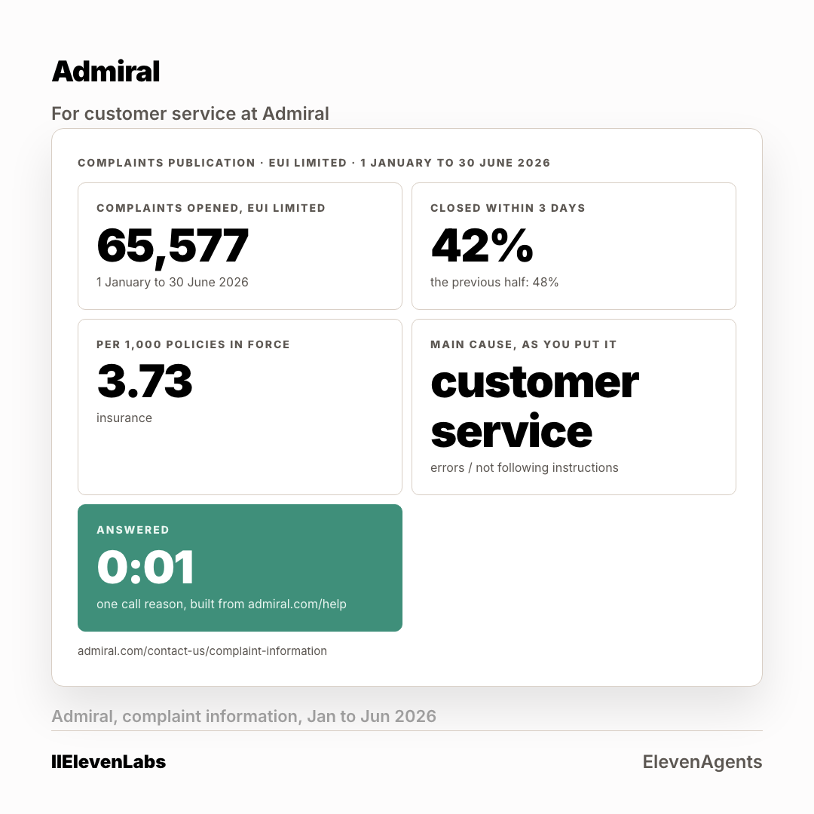

# The ad: Admiral Group

A second crop at 4:5 is in [`card-4x5.png`](card-4x5.png). Two ratios per account, because
the feed serves them differently.

**You cannot open the real ad.** A LinkedIn ad preview is only visible to someone signed in
with access to the advertising account it lives in. Everything the ad carries is below.

## What it says

**Body copy**

> Your own publication names the main cause of 65,577 complaints: customer service, errors and instructions not followed. Those happen on the calls done fastest. One call reason, answered on the first ring, following admiral.com/help exactly as written. 48 hours.

**Headline**

> Your own complaints return, and the line that does not skip a step

**Button** `Learn More` · **Destination** the page in [`../landing-page/`](../landing-page/index.html)

## Who sees it

| | |
|---|---|
| Organisation | Admiral Group, and no other |
| The lever that got it into band | **five functions at Manager and above** |
| Country | United Kingdom |
| People it can reach | **710** |

**This is the account where the shared lever failed.** Applied to everyone, it left
Admiral Group at 2,100 people, well above the band. Every one of the six came out above band on
the shared setting. The lever is chosen per account, not once for the campaign, and the
narrowing for this one reads 6,500 at the company, 4,100 once junior roles come out, then
five functions at Manager and above to reach 710.

Ad set id `AD_SET_ID`, status **DRAFT**. Nothing was activated and nothing was spent.
