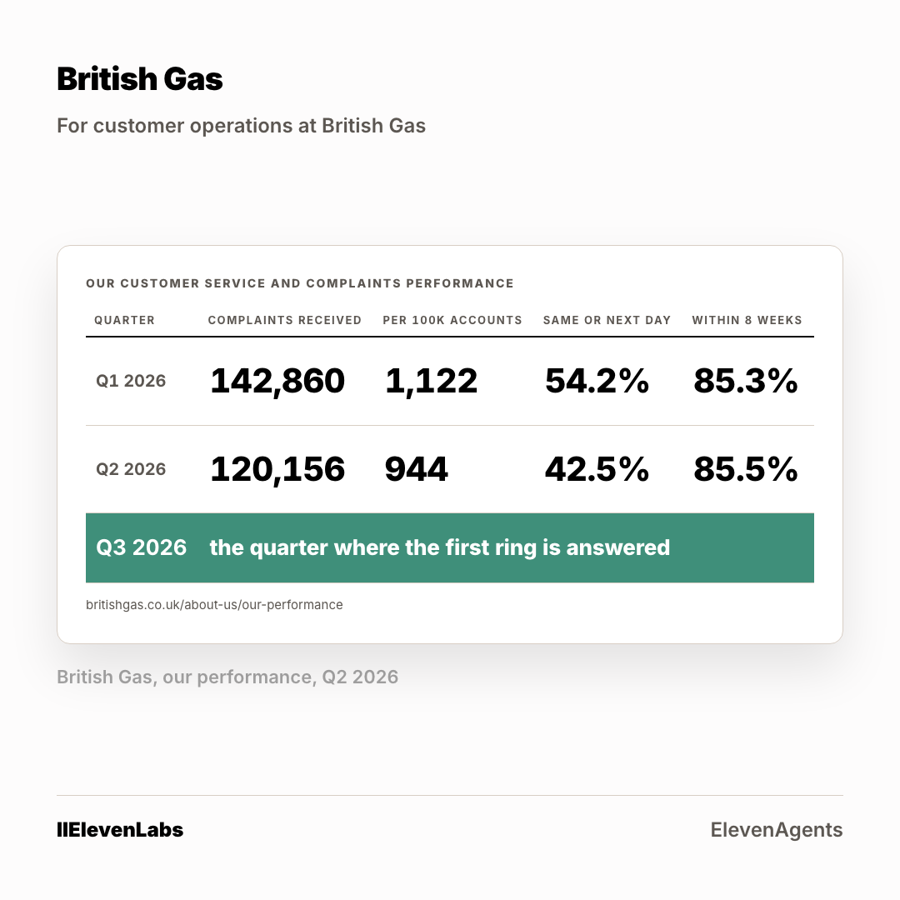

# The ad: British Gas

A second crop at 4:5 is in [`card-4x5.png`](card-4x5.png). Two ratios per account, because
the feed serves them differently.

**You cannot open the real ad.** A LinkedIn ad preview is only visible to someone signed in
with access to the advertising account it lives in. Everything the ad carries is below.

## What it says

**Body copy**

> You publish it yourself: 120,156 complaints in Q2, and the share resolved by the next working day fell from 54.2% to 42.5% in one quarter. The queue is not the problem. The volume that fills it is. One call reason, answered on the first ring, built from your own help pages. 48 hours.

**Headline**

> Your own quarterly table, and the row you have not written yet

**Button** `Learn More` · **Destination** the page in [`../landing-page/`](../landing-page/index.html)

## Who sees it

| | |
|---|---|
| Organisation | British Gas, and no other |
| The lever that got it into band | **five functions at Manager and above** |
| Country | United Kingdom |
| People it can reach | **820** |

**This is the account where the shared lever failed.** Applied to everyone, it left
British Gas at 3,300 people, well above the band. Every one of the six came out above band on
the shared setting. The lever is chosen per account, not once for the campaign, and the
narrowing for this one reads 12,000 at the company, 6,100 once junior roles come out, then
five functions at Manager and above to reach 820.

Ad set id `AD_SET_ID`, status **DRAFT**. Nothing was activated and nothing was spent.
