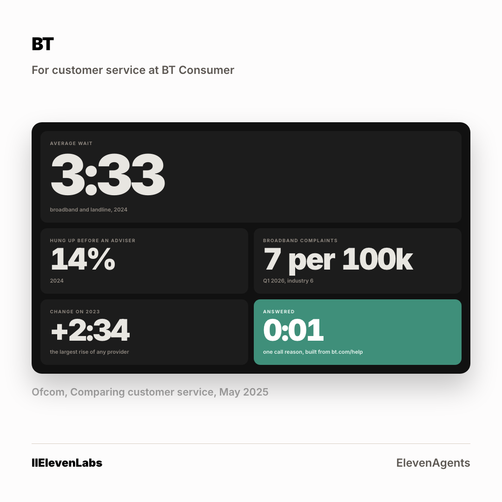

# The ad: BT Group

A second crop at 4:5 is in [`card-4x5.png`](card-4x5.png). Two ratios per account, because
the feed serves them differently.

**You cannot open the real ad.** A LinkedIn ad preview is only visible to someone signed in
with access to the advertising account it lives in. Everything the ad carries is below.

## What it says

**Body copy**

> Ofcom prints one number about your phone line: 3:33 on average, and one caller in seven gone before an adviser picked up. Your callers are not hanging up on your advisers. They are hanging up on the wait. One call reason, answered on the first ring, built from bt.com/help, on a real number you can ring. 48 hours.

**Headline**

> Your wallboard, with one tile you do not have yet

**Button** `Learn More` · **Destination** the page in [`../landing-page/`](../landing-page/index.html)

## Who sees it

| | |
|---|---|
| Organisation | BT Group, and no other |
| The lever that got it into band | **38 committee titles, junior excluded** |
| Country | United Kingdom |
| People it can reach | **800** |

**This is the account where the shared lever failed.** Applied to everyone, it left
BT Group at 12,000 people, well above the band. Every one of the six came out above band on
the shared setting. The lever is chosen per account, not once for the campaign, and the
narrowing for this one reads 49,000 at the company, 27,000 once junior roles come out, then
38 committee titles, junior excluded to reach 800.

Ad set id `AD_SET_ID`, status **DRAFT**. Nothing was activated and nothing was spent.
