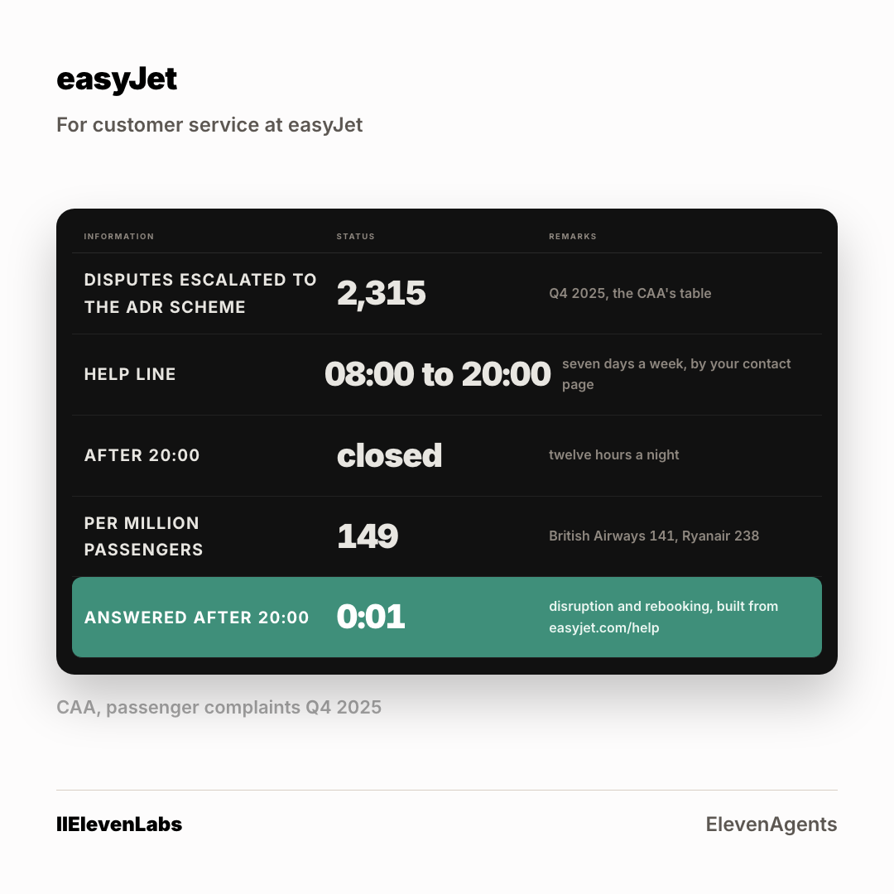

# The ad: easyJet

A second crop at 4:5 is in [`card-4x5.png`](card-4x5.png). Two ratios per account, because
the feed serves them differently.

**You cannot open the real ad.** A LinkedIn ad preview is only visible to someone signed in
with access to the advertising account it lives in. Everything the ad carries is below.

## What it says

**Body copy**

> A cancellation at nine in the evening is the call that matters most, and your help line is published as open 8 to 8. The CAA counted 2,315 escalated disputes in one quarter. Most began as a call nobody could take. One call reason, answered at 21:04, built from easyjet.com/help. 48 hours.

**Headline**

> Your departures board, after the help line has closed

**Button** `Learn More` · **Destination** the page in [`../landing-page/`](../landing-page/index.html)

## Who sees it

| | |
|---|---|
| Organisation | easyJet, and no other |
| The lever that got it into band | **Finance, IT, Product and Support, junior excluded** |
| Country | United Kingdom |
| People it can reach | **800** |

**This is the account where the shared lever failed.** Applied to everyone, it left
easyJet at 3,700 people, well above the band. Every one of the six came out above band on
the shared setting. The lever is chosen per account, not once for the campaign, and the
narrowing for this one reads 8,800 at the company, 4,700 once junior roles come out, then
Finance, IT, Product and Support, junior excluded to reach 800.

Ad set id `AD_SET_ID`, status **DRAFT**. Nothing was activated and nothing was spent.
