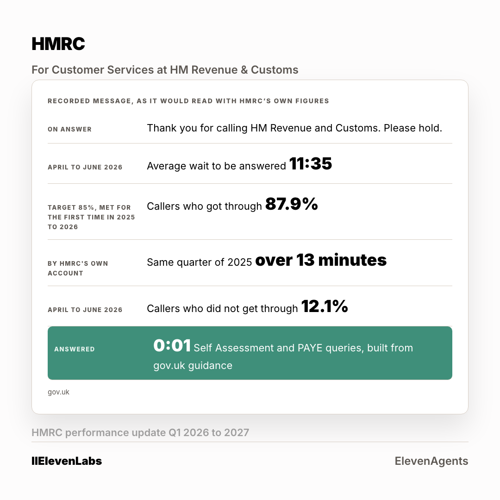

# The ad: HMRC

A second crop at 4:5 is in [`card-4x5.png`](card-4x5.png). Two ratios per account, because
the feed serves them differently.

**You cannot open the real ad.** A LinkedIn ad preview is only visible to someone signed in
with access to the advertising account it lives in. Everything the ad carries is below.

## What it says

**Body copy**

> Your own update halved the wait and met the 85% target for the first time. The floor of what people can do is 11 minutes 35 seconds, and 12.1% who never get through. One query type, answered before the first ring ends, built from gov.uk guidance. 48 hours.

**Headline**

> Your hold message, with the line that replaces it

**Button** `Learn More` · **Destination** the page in [`../landing-page/`](../landing-page/index.html)

## Who sees it

| | |
|---|---|
| Organisation | HMRC, and no other |
| The lever that got it into band | **five functions at Director and above** |
| Country | United Kingdom |
| People it can reach | **890** |

**This is the account where the shared lever failed.** Applied to everyone, it left
HMRC at 7,000 people, well above the band. Every one of the six came out above band on
the shared setting. The lever is chosen per account, not once for the campaign, and the
narrowing for this one reads 29,000 at the company, 17,000 once junior roles come out, then
five functions at Director and above to reach 890.

Ad set id `AD_SET_ID`, status **DRAFT**. Nothing was activated and nothing was spent.
