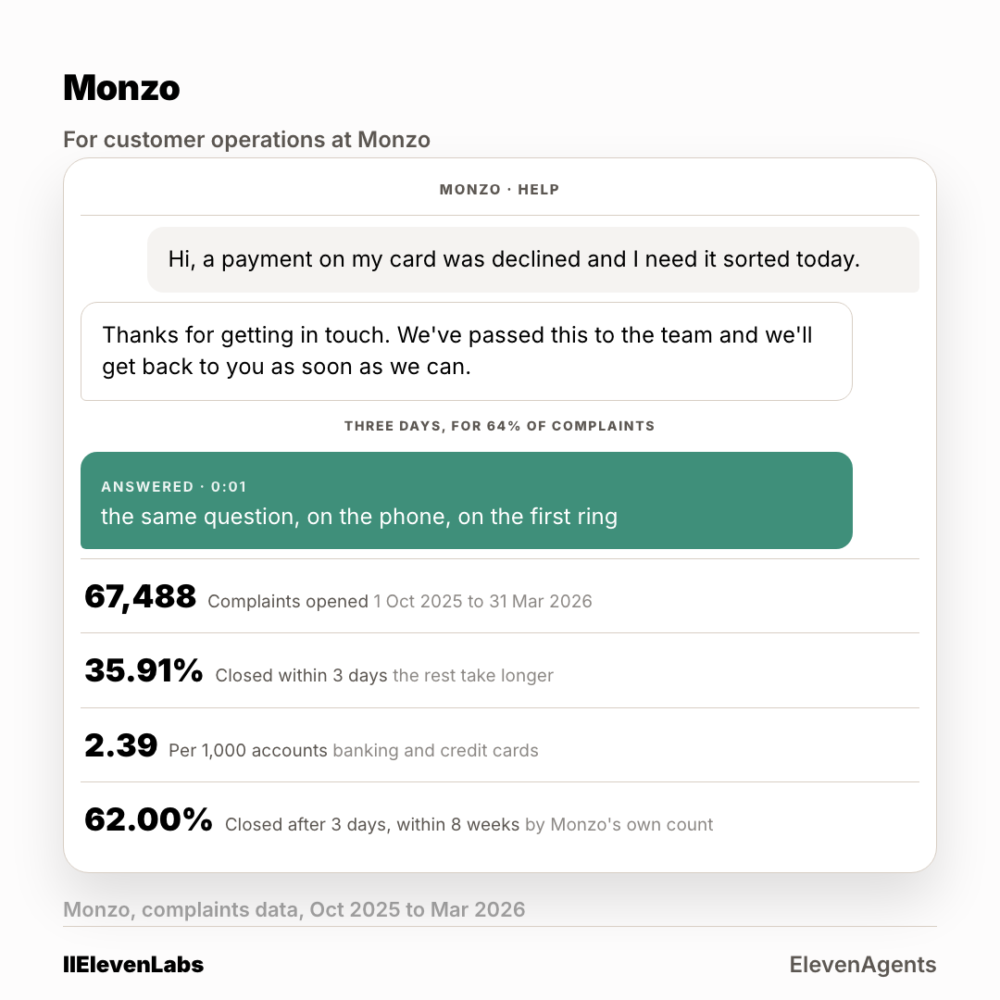

# The ad: Monzo Bank

A second crop at 4:5 is in [`card-4x5.png`](card-4x5.png). Two ratios per account, because
the feed serves them differently.

**You cannot open the real ad.** A LinkedIn ad preview is only visible to someone signed in
with access to the advertising account it lives in. Everything the ad carries is below.

## What it says

**Body copy**

> Your own return says 67,488 complaints in six months, and 64% of them take longer than three days to close. Every one of those started as a thread that sat. One call reason, answered on the first ring, built from monzo.com/help, on a real number you can ring. 48 hours.

**Headline**

> The thread that sat, and the reply that did not

**Button** `Learn More` · **Destination** the page in [`../landing-page/`](../landing-page/index.html)

## Who sees it

| | |
|---|---|
| Organisation | Monzo Bank, and no other |
| The lever that got it into band | **five functions at Manager and above** |
| Country | United Kingdom |
| People it can reach | **460** |

**This is the account where the shared lever failed.** Applied to everyone, it left
Monzo Bank at 1,800 people, well above the band. Every one of the six came out above band on
the shared setting. The lever is chosen per account, not once for the campaign, and the
narrowing for this one reads 8,500 at the company, 3,800 once junior roles come out, then
five functions at Manager and above to reach 460.

Ad set id `AD_SET_ID`, status **DRAFT**. Nothing was activated and nothing was spent.
