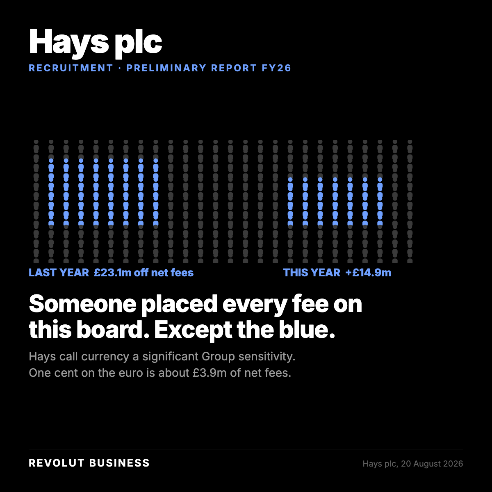

# The ad: Hays plc

A 4:5 crop is in [`card-4x5.png`](card-4x5.png).

**You cannot open the real ad.** A LinkedIn ad preview is only visible to someone signed in
with access to the advertising account it lives in. Everything the ad carries is below.

## What it says

**Body copy**

> Not a rate. A figure.

Every conversion Hays made last month, set beside the interbank rate for the same day and the
same amount. The gap comes back in basis points and in pounds, one number per currency, with
the workings attached.

If it lands under 10 basis points we put that in writing and there is nothing to sell you.

Fourteen days. No fee.

**Headline**

> One month in. One figure back.

**Button** `Learn More` · **Destination** the page in [`../landing-page/`](../landing-page/index.html)

## Who sees it

| | |
|---|---|
| Company | Hays plc, Recruitment |
| Function | Accounting, Finance, Operations, Programme and project management |
| Excluded | Unpaid, Training, Entry level |
| Country | United Kingdom |
| People it can reach | **1,100** |

## Finding this company on LinkedIn nearly failed

"Hays plc" returned a single result called **"works of Hays PLC"**, a clone page with nobody attached. The trading name resolved first try.

The run log records this for all three: **the legal name is the wrong query.** A company's
registered name and the name on its LinkedIn page are different strings, and the typeahead
answers the second one. The number that comes back when you search the wrong one is `0`, and
a `0` reads exactly like a company too small to advertise to.

Ad set id `AD_SET_ID`, status **DRAFT**. Nothing was activated and nothing was spent.
