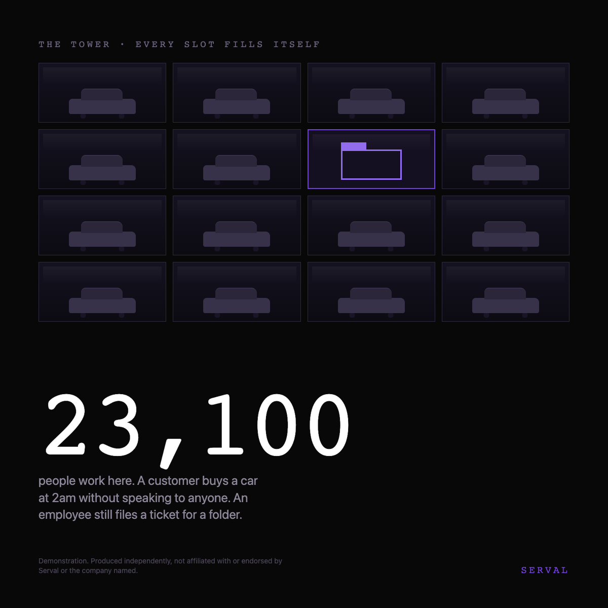

# The ad: Carvana

**You cannot open the real ad.** A LinkedIn ad preview is only visible to someone signed in
with access to the advertising account it lives in, so the link would be useless here.
Everything the ad carries is written out below instead, exactly as it was configured.

## What it says

**Body copy**

> A customer buys a car at two in the morning without speaking to anyone. An employee who needs a shared folder files a ticket and waits for a person. Same company.

**Headline**

> You automated the hardest purchase in retail.

**Button** `Learn More`

**Where it goes** [https://jeanmundabi-max.github.io/mdb-abm/serval/carvana/](https://jeanmundabi-max.github.io/mdb-abm/serval/carvana/) · the same page is in
[`../landing-page/`](../landing-page/index.html)

## Who sees it

| | |
|---|---|
| Company | Carvana, and no other |
| Function | Information Technology |
| Excluded | Unpaid, Training, Entry level |
| Country | United States |
| People it can reach | **640**, measured on LinkedIn on 24 September 2026 |

That last figure is not a headcount. It is what LinkedIn will let an advertiser reach in that
function, in that country, which is the only outside measure of the group that carries this.

## How it was built

**Headline formula: Shame.** One of six, chosen before the line was written rather
than picked afterwards to describe what came out.

**The card is an object from Carvana's own world**, with Serval's violet marking the one element
that carries the meaning, and Carvana's own filed number as the biggest thing on it. The test is
to cover the words: the picture alone should say who it is for.

Ad set `Serval - US - Stage1Cold - Unaware - SingleImage - Carvana`, id `AD_SET_ID`, status
**DRAFT**. Nothing was activated and nothing was spent.
