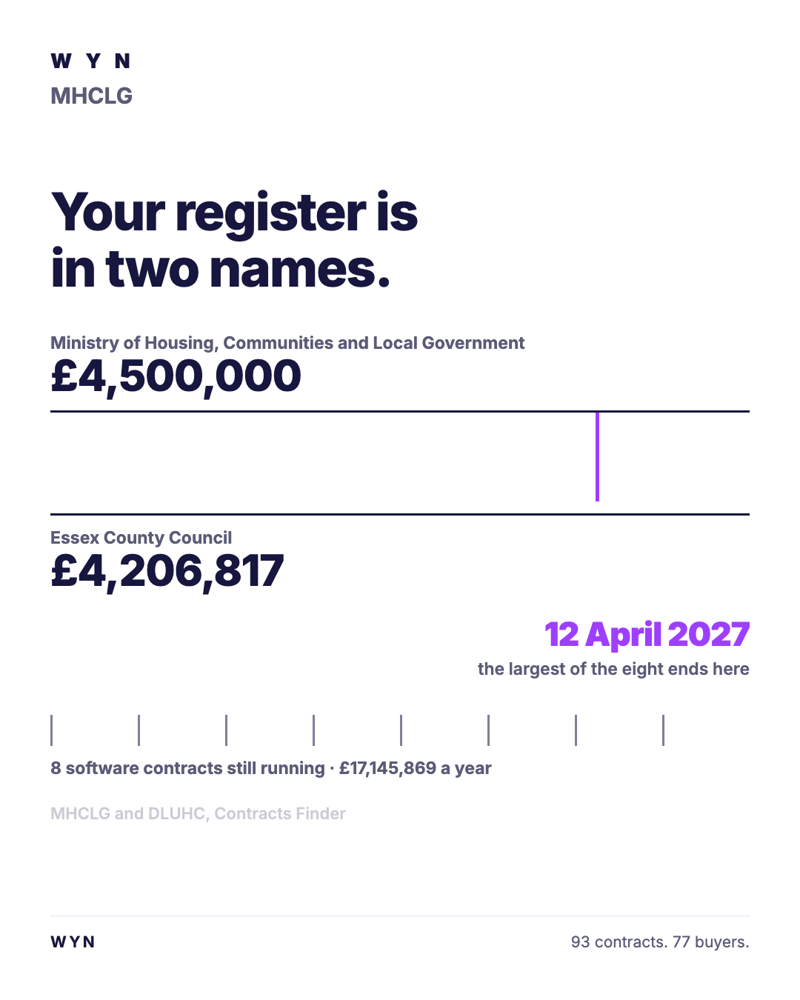

# The ad: MHCLG

**You cannot open the real ad.** A LinkedIn ad preview is only visible to someone signed in
with access to the advertising account it lives in. Everything the ad carries is written out
below, exactly as it was configured on 21 August 2026.

## What it says

**Body copy**

> You published the award notice yourself, so anyone can read it. MHCLG has 3 software contracts running. The first to expire does so in 10 days, and a renewal is the only moment the price is negotiable. A free contract review says whether the number is the right number, and costs nothing if it is.

**Headline**

> MHCLG: 3 software contracts, the first ends in 10 days

**Button** `Learn More`

**Where it went** `https://jeanmundabi-max.github.io/mdb-abm-gocardless/w/mhclg/` · **this address no longer resolves.** The page itself
is in [`../landing-page/`](../landing-page/index.html) and still works. GitHub Pages does not
redirect after a repository is renamed, which is how six ad destinations were lost once.

## Two things wrong with this copy, left in on purpose

**The day count is stale.** "the first ends in 101 days" was true on 21 August 2026. The same
deadline is 66 days away as this is written. A number baked into ad copy is wrong the next
morning, and the run log for this campaign **opens with exactly that finding**: the live page
carried a countdown that had been frozen for eighteen days before anyone noticed. The page was
rebuilt to compute the interval when it loads. The ad copy was not.

**The headline reads "the Home Office" mid-sentence** on one account, because the display name
carried its article into a template. Small, and it is the kind of thing that survives to a
real impression.

Both are shown as built rather than quietly corrected, because the point of publishing a run
is that you can check it.

## Who sees it

| | |
|---|---|
| Organisation | MHCLG, and no other |
| Function | Finance, technology, operations and programme |
| Excluded | Unpaid, Training, Entry level |
| Country | United Kingdom |
| People it can reach | **700**, measured on LinkedIn on 21 August 2026 |

Ad set `WYN - ...  - MHCLG`, id `AD_SET_ID`, status **DRAFT**. Nothing was activated and
nothing was spent.
